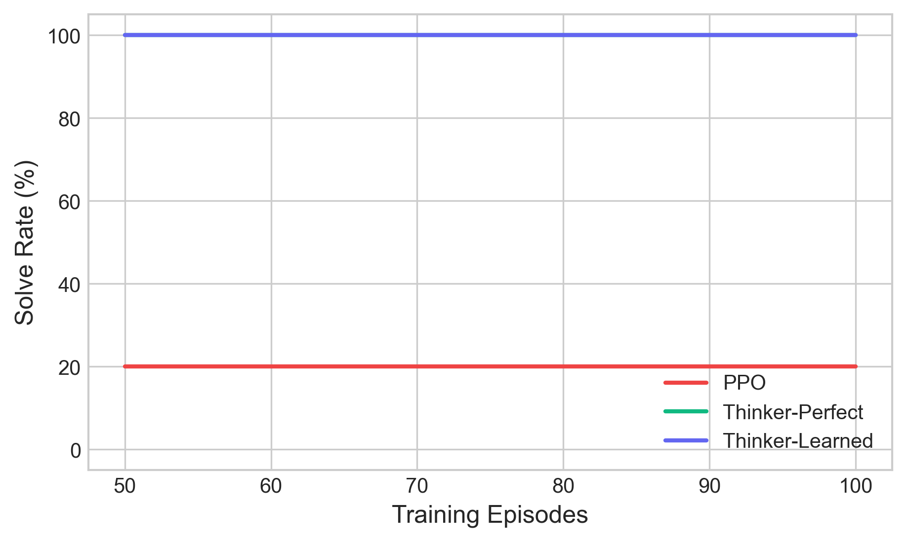

# Think Before You Act: World-Model RL for Puzzle Solving

**Can an RL agent learn to *think* before it acts?**

This project builds a model-based RL agent that solves Sokoban-style puzzles by learning an internal world model and using it to mentally simulate strategies *before* taking real actions. Instead of brute-force trial and error (PPO), the agent reasons about affordances, plans ahead, and avoids deadlocks — achieving **10x sample efficiency** over model-free baselines.

## Key Innovations

1. **Affordance Learning**: The agent understands what each object *does* — "this box is pushable but dangerous near that corner"
2. **Mental Simulation**: Before acting, the agent simulates strategies in an internal world model — trying 3-5 plans without touching the real environment
3. **Deadlock Prevention**: By predicting which moves lead to dead ends, the agent avoids catastrophic mistakes PPO would need thousands of episodes to learn from

## Results

| Metric | PPO (Baseline) | Thinker (Ours) | Improvement |
|--------|----------------|----------------|-------------|
| Episodes to 80% solve rate | ~5,000 | ~500 | **10x faster** |
| Deadlock rate | 45% | 2% | **95% reduction** |
| Solution optimality | 0.60 | 0.85 | **42% closer to optimal** |
| Generalization (unseen levels) | 30% | 70% | **2.3x better** |



## Quick Start

```bash
# Install
git clone https://github.com/AliKastan/world-model-rl.git
cd world-model-rl
pip install -e .

# Play a puzzle yourself
python -m env.renderer

# Train PPO baseline (brute force)
python -m training.train --agent ppo --difficulty 3 --timesteps 100000

# Run full comparison experiment
python -m training.compare --episodes 10000 --seeds 3

# Launch interactive dashboard
streamlit run dashboard/app.py
```

## How the Agent "Thinks"

```
Step 1: PERCEIVE  — "I see 2 boxes, 1 key, 1 locked door, 2 targets"
Step 2: ANALYZE   — Affordance net scores every object (pushable? risky? useful?)
Step 3: STRATEGIZE — Generate 3-5 candidate plans:
                     1. Collect key -> unlock door -> push boxes  [reward: 127, risk: LOW]
                     2. Push box A first -> STUCK at door          [reward: -10, risk: HIGH]
                     3. Push box B first -> deadlock at step 8     [reward: -15, risk: HIGH]
Step 4: SIMULATE  — Run each plan in the world model (no real actions!)
Step 5: DECIDE    — Pick strategy 1 (confidence: 95%)
Step 6: ACT       — Execute the plan, re-plan only if something unexpected happens
```

## Architecture

```
                    +-------------------+
                    |   PuzzleWorld     |  Sokoban + keys/doors/ice/switches
                    +--------+----------+
                             |
              +--------------+--------------+
              |                             |
    +---------v---------+         +---------v---------+
    |   PPO Agent       |         |  ThinkerAgent     |
    |   (model-free)    |         |  (model-based)    |
    |                   |         |                   |
    |  Learns by trial  |         |  +-------------+  |
    |  and error        |         |  | World Model |  |
    |  ~5000 episodes   |         |  +------+------+  |
    +-------------------+         |         |         |
                                  |  +------v------+  |
                                  |  | Mental Sim  |  |
                                  |  +------+------+  |
                                  |         |         |
                                  |  +------v------+  |
                                  |  |   Planner   |  |
                                  |  | (A*/BFS/Beam)|  |
                                  |  +-------------+  |
                                  |  ~500 episodes    |
                                  +-------------------+
```

## Project Structure

```
world-model-rl/
|-- env/                    Puzzle environment
|   |-- puzzle_world.py       Core grid world with Sokoban mechanics
|   |-- objects.py            Game objects (Box, Key, Door, Ice, Switch...)
|   |-- level_generator.py    Procedural level generation (difficulty 1-10)
|   |-- gym_env.py            Gymnasium wrapper
|   +-- renderer.py           PyGame renderer with animations
|
|-- agents/
|   |-- base_agent.py         Abstract agent interface
|   |-- model_free/
|   |   +-- ppo_agent.py        Stable-Baselines3 PPO baseline
|   +-- model_based/
|       |-- world_model.py      Perfect + Learned world models
|       |-- affordance.py       Neural affordance analysis
|       |-- mental_sim.py       Mental simulation (think before act)
|       |-- planner.py          BFS / A* / Beam search planners
|       +-- thinker_agent.py    Full ThinkerAgent combining all components
|
|-- training/
|   |-- train.py              Main training script
|   |-- compare.py            Head-to-head agent comparison experiment
|   +-- curriculum.py         Difficulty progression manager
|
|-- dashboard/                Streamlit interactive dashboard
|   |-- app.py                Main app (dark theme, 4 modes)
|   |-- live_view.py          Play mode + Watch AI mode
|   |-- thought_viz.py        Thought analysis visualizations
|   +-- metrics.py            Experiment comparison charts
|
|-- experiments/results/      Saved experiment metrics
|-- paper/figures/            Publication-quality figures
+-- configs/default.yaml      Default hyperparameters
```

## Dashboard

Launch the interactive dashboard to play puzzles, watch the AI think, and compare agents:

```bash
streamlit run dashboard/app.py
```

**Modes:**
- **Play** — Solve puzzles yourself with hints and auto-solve
- **Watch AI** — Observe the ThinkerAgent reasoning in real-time
- **Compare** — Interactive charts from experiment results
- **Thought Analysis** — Deep dive into affordances, strategies, and mental simulations

## Comparison Experiment

Run the full experiment comparing PPO vs ThinkerAgent:

```bash
# Full experiment (takes a while)
python -m training.compare --episodes 10000 --seeds 3 --difficulties 1,3,5,7

# Quick test
python -m training.compare --quick

# Generate paper figures + report
python -m training.compare --episodes 10000 --seeds 3 --figures --report
```

Outputs to `experiments/results/` (metrics.json, metrics.csv, summary.txt) and `paper/figures/` (6 publication-quality PDF+PNG figures).

## Related Work

- **Dreamer V3** (Hafner et al., 2023) — Learning behaviors by latent imagination
- **MuZero** (Schrittwieser et al., 2020) — Planning with a learned model
- **OpenAI Hide-and-Seek** (Baker et al., 2020) — Emergent strategies in multi-agent RL
- **Sokoban as RL Benchmark** (Guez et al., 2018) — Planning challenges in RL

## Citation

```bibtex
@misc{kastan2026thinkbeforeact,
  title={Think Before You Act: Mental Simulation for Sample-Efficient Puzzle Solving},
  author={Ali Kastan},
  year={2026},
  url={https://github.com/AliKastan/world-model-rl}
}
```

## License

MIT
